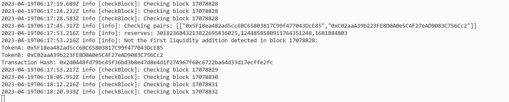

<!-- ABOUT THE PROJECT -->
## About The Project



The project processes blocks in the etherium network and catches transactions adding the first liquidity to the token.
- Keeps logs
- Sends notifications to telegram

### Built With

- node.js
- ethers
- redis
- telegraf
- winston
- winston-daily-rotate-file

<!-- GETTING STARTED -->
## Getting Started

### Installation

1. Clone the repo
   ```sh
   git clone https://github.com/ziaq/first-liquidity-detector.git
   ```
3. Install NPM packages
   ```sh
   npm install
   ```
4. Enter your settings in `config/config.js`
   ```js
   module.exports = {
      rpcUrl: 'https://eth.llamarpc.com', // For example
      redisUrl: 'redis://localhost:6379', // If you run redis locally
      telegramBotToken: '3199528576:LHHXZCkje0xf9NFEkzFI2wL2yB0lYRXbOy', // It's not my bot token :)
      telegramChatId: '952347451',
      wethPriceInUsd: 2000, // Сhange to the actual rate
      startBlockNumber: 'latest', // pur here 'latest' for starting from latest block
   };
   ```

<!-- USAGE EXAMPLES -->
## Usage

1. Run in the terminal while in the project directory 
   ```sh
   npm start
   ```

## Contact

- Twitter https://twitter.com/RomaZiaq
- Telegram @roma_ziaq
- Project Link: https://github.com/ziaq/first-liquidity-detector